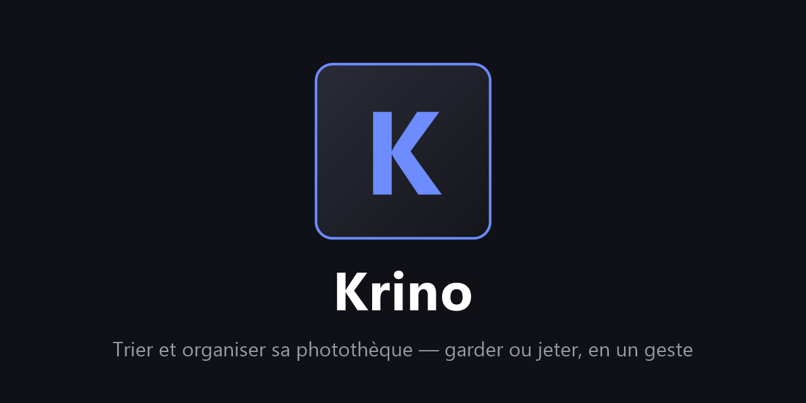

# Krino



> Du grec κρίνω — *juger, trier, décider*.

[](https://ko-fi.com/G2G71YFHWX)

Application de bureau pour **épurer sa photothèque** : on parcourt ses photos et
vidéos mois par mois, et pour chacune on décide — **garder** ou **jeter** — au
clavier, à la souris ou d'un **swipe**. Rien n'est supprimé sans une revue et
une validation explicites, et tout passe d'abord par une corbeille interne.

## 🏁 Démarrer

Krino travaille sur **un seul dossier de départ** : réunissez d'abord vos photos
et vidéos au même endroit (par exemple `D:\Photos`). Peu importe l'organisation
interne — fichiers **en vrac**, sous-dossiers, mélange des deux — Krino scanne
tout récursivement, regroupe par mois et n'a besoin de rien d'autre. Ouvrez ce
dossier au premier lancement, et c'est parti : le tri, les albums et le
rangement se font ensuite depuis l'application.

Construit avec [Tauri 2](https://tauri.app) (Rust + WebView) : exécutable léger,
démarrage instantané, aucune dépendance à installer pour l'utilisateur final.

## ✨ Fonctionnalités

- **Tri par mois** : les fichiers sont regroupés par mois (date de modification),
  présentés chronologiquement, avec progression par mois.
- **Trois façons de décider** : boutons à la souris, raccourcis clavier
  **configurables** (défaut : → garder, ← jeter, ⌫ annuler), et **swipe**
  gauche/droite façon Tinder avec animation.
- **Revue de fin de mois** : avant toute action, un écran récapitule les
  gardées et les jetées (cliquer sur une vignette inverse sa décision), puis on
  **valide** — les fichiers jetés partent dans la corbeille interne.
- **Corbeille interne** (`.krino/corbeille`) : les fichiers y conservent leur
  arborescence d'origine. On peut **tout restaurer** ou **vider définitivement**
  pour libérer l'espace.
- **Mois faits** marqués ✔, refaisables individuellement ; **reset global** pour
  une deuxième passe d'épuration.
- **Filtres** : tri chronologique (les deux sens), par taille, par nombre de
  fichiers, par restants à trier ; option pour masquer les mois faits.
- **Accélérateurs** : préchargement des images suivantes, bouton « Garder le
  reste », annulation illimitée dans la session, reprise automatique du dernier
  dossier.
- **Vidéos** prises en charge (lecture directe dans la visionneuse).
- **Thème clair / sombre / automatique** (suit le mode de Windows).
- **Mois regroupés par année** (désactivable) avec aperçu de 3 photos en éventail sur chaque carte.
- **Tutoriel intégré** au premier lancement, sur un dossier d'images de démonstration — revisionnable depuis les Réglages.
- **Comparateur de rafales**, **zoom** à la molette, regroupement par **date EXIF ou date de fichier**, HEIC/TIFF via Windows Imaging Component.
- **Regroupement par événement** (séances de prise de vue) en plus du mois calendaire.
- **Deux modes** reliés par une barre latérale : **Trier** (cartes swipe) et **Organiser** — **Galerie** optimisée (chargement/déchargement des vignettes hors écran, saut du rendu hors écran via **content-visibility**, cache d'affichage, tri par défaut du plus récent au plus ancien), avec filtres, sélection multiple Ctrl/Maj/rectangle, favoris en **cœur**, et **visionneuse** (swipe souris/tactile, clic extérieur pour fermer).
- **Miniatures fidèles** : l'**orientation EXIF** est appliquée à la génération, les photos prises en portrait s'affichent droites.
- **Dossiers récents à l'accueil** : la page d'ouverture propose le dernier dossier trié et les précédents, rouvrables en un clic.
- **Albums** : page d'accueil dédiée avec aperçu façon carte de mois, sidebar limitée à 3 albums réordonnables par glisser-déposer (+ Favoris toujours visible), bouton **« Déplacer dans l'album »** depuis la Galerie qui revient au même défilement.
- **Doublons** interactifs (exacts ou semblables par empreinte perceptuelle, tolérance réglable) avec un **écran de vérification** récapitulatif avant tout envoi à la corbeille.
- **Rangement** Année/Mois avec **aperçu de l'arborescence** créée avant confirmation, et journal d'annulation.
- **Corbeille** en grille façon galerie : sélection multiple (Ctrl/Maj/rectangle), **Restaurer** ou **Supprimer définitivement**.
- **Dialogues intégrés** (plus aucun popup natif du navigateur), scrollbars et menus déroulants custom (clair/sombre).
- **Tâches longues annulables** (scan, analyse de doublons, rangement).

## 🚀 Développement

Prérequis : [Rust](https://rustup.rs) (toolchain MSVC sous Windows), Node.js.

```bash
npm install
npm run tauri dev     # lancement en mode développement
npm run tauri build   # exécutable + installeur dans src-tauri/target/release
.\publier.ps1         # build signé + release GitHub avec manifeste de mise à jour
```

### Mises à jour automatiques

Krino vérifie au démarrage si une version plus récente est publiée sur GitHub
(manifeste `latest.json` attaché à la dernière release) et propose de la
**télécharger et l'installer directement depuis l'application**. Les paquets
sont signés (clé minisign) : l'updater refuse tout binaire dont la signature
ne correspond pas à la clé publique embarquée. La mise à jour peut être
installée **maintenant**, **à la fermeture** de l'application (téléchargée puis
posée au moment où vous quittez, sans interrompre votre tri) ou **plus tard**.

## 🗂️ Données

- L'état du tri (décisions, mois validés, raccourcis) est stocké dans
  `<dossier>/.krino/etat.json` — le dossier trié est autonome, l'état voyage avec lui.
- Formats reconnus : jpg, jpeg, png, gif, webp, bmp, tiff, avif / mp4, mov,
  m4v, webm, mkv, avi, 3gp.
- Le regroupement utilise la **date EXIF** (ou la date de fichier, au choix dans
  les Réglages) ; HEIC/TIFF sont décodés côté Rust via Windows Imaging Component.

## 🛡️ Sécurité des données

Krino ne supprime **jamais** un fichier directement :

1. décider (garder/jeter) ne touche pas au disque ;
2. valider un mois **déplace** les jetés vers `.krino/corbeille` ;
3. seule l'action « Vider la corbeille », confirmée, supprime réellement.

Les conditions d'utilisation (avec décharge de responsabilité) sont affichées et
doivent être acceptées au premier lancement. **Faites une sauvegarde avant tout tri.**

## L'application est bloquée par Windows ?

Krino n'est pas signé par un certificat commercial ; Windows peut donc se méfier :

- **SmartScreen** (« Windows a protégé votre ordinateur ») : cliquer sur
  **Informations complémentaires** puis **Exécuter quand même**. Cela n'arrive
  qu'au premier lancement.
- **Microsoft Defender** signale le fichier : ouvrir Sécurité Windows →
  *Protection contre les virus et menaces* → *Historique de protection*,
  sélectionner l'entrée concernant Krino et choisir **Autoriser**.
- **Smart App Control** (Windows 11) : cette protection **n'a pas de liste
  d'exclusions** — elle bloque tout exécutable non signé. Il faut soit la
  désactiver (Sécurité Windows → *Contrôle des applications et du navigateur* →
  *Paramètres de Smart App Control* → Désactivé, action irréversible), soit
  renoncer à utiliser Krino sur cette machine.

Le code est ouvert : vous pouvez l'auditer et compiler vous-même l'exécutable
(`npm run tauri build`) plutôt que de télécharger la release.

## Licence

MIT — voir [LICENSE](LICENSE). Logiciel fourni « tel quel », sans garantie.
